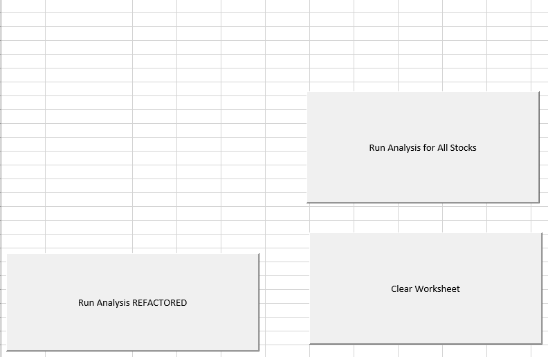

# Stock Analysis with VBA and Excel
## Overview - VBA project
### Purpose 
The purpose of this project and subsequent analysis is to edit, refactor a stock market dataset with VBA solution code to loop through all the data one time to collect an entire dataset.  Refactoring is a key part of the coding process – when refactoring code, adding functionality is not the key – the goal is to gain efficiencies in concise coding or reducing memory / resource utilization.  Therefore, part of the deliverable is to also verify the changes made through refactoring of the VBA script were successful in making the code more efficient.  Please refer to the [VBA_Challenge.xlms](VBA_Challenge.xlsm) for reference - this spreadsheet contains all relevant material.  The 'All Stocks Analysis' sheet contains all buttons shown here.  
