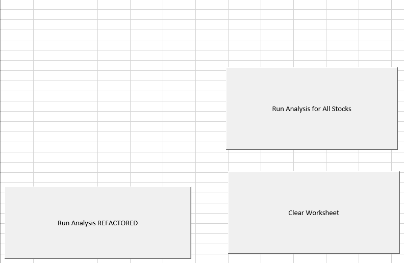
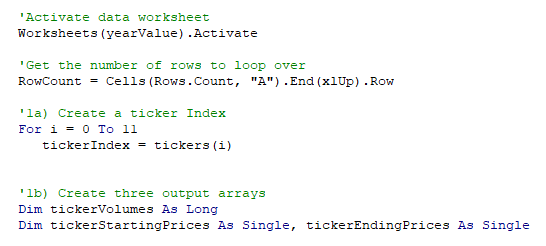
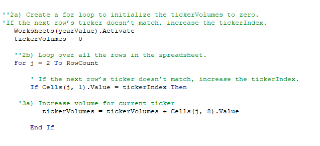
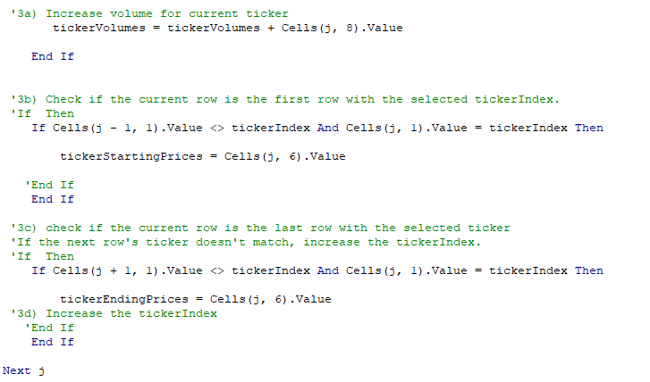
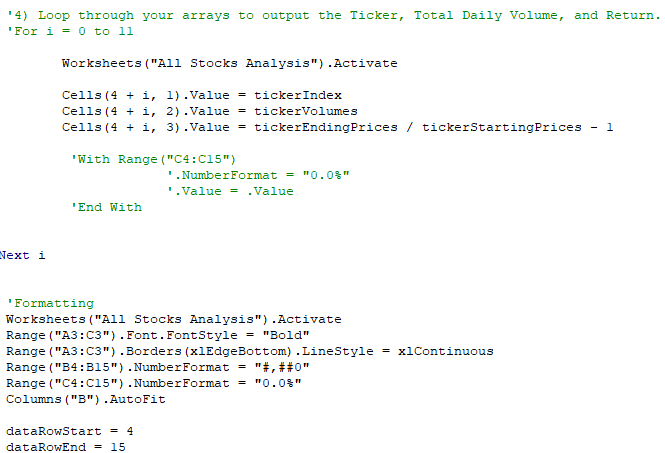
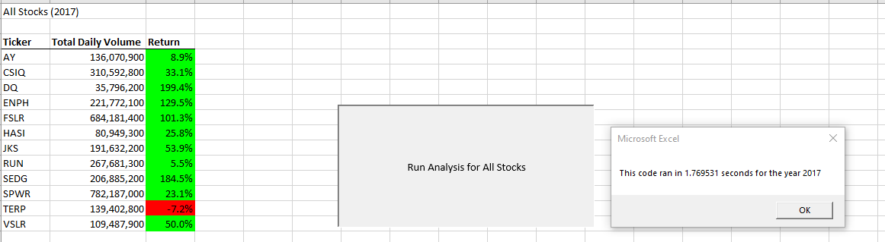
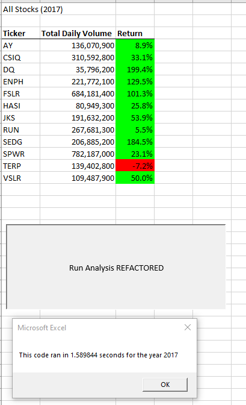
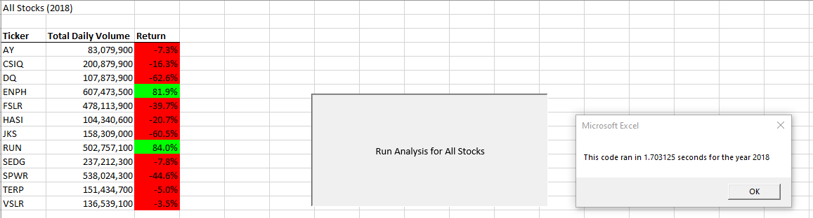
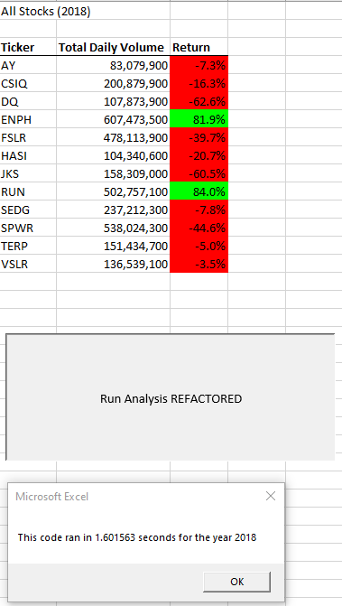

# Stock Analysis with VBA and Excel
## Overview - VBA project
### Purpose 
The purpose of this project and subsequent analysis is to edit, refactor a stock market dataset with VBA solution code to loop through all the data one time to collect an entire dataset.  Refactoring is a key part of the coding process – when refactoring code, adding functionality is not the key – the goal is to gain efficiencies in concise coding or reducing memory / resource utilization.  Therefore, part of the deliverable is to also verify the changes made through refactoring of the VBA script were successful in making the code more efficient.  Please refer to the [VBA_Challenge.xlms](VBA_Challenge.xlsm) for reference - this spreadsheet contains all relevant material.  The 'All Stocks Analysis' sheet contains all buttons shown here.  

## Results
### Deliverable Requirements and Coding Examples

1. The tickerIndex is set equal to zero before looping over the rows.
A tickerIndex variable was created and set it equal to zero before iterating over all the rows. 
The tickerIndex is utilized to access the correct index across the four different arrays on VBA Code.

2. Arrays are created for tickers, tickerVolumes, tickerStartingPrices, and tickerEndingPrices.
Three output arrays are created: tickerVolumes, tickerStartingPrices, and tickerEndingPrices. In this VBA project, the tickerVolumes 
array will be a Long data type while the tickerStartingPrices and tickerEndingPrices arrays will be a Single data type.

3. The tickerIndex is used to access the stock ticker index for the tickers, tickerVolumes, tickerStartingPrices, and tickerEndingPrices arrays.
A loop was created to initialize the tickerVolumes to zero.  If the next row’s ticker doesn’t match, increase the tickerIndex.

4. The script loops through stock data, reading and storing all of the following values from each row: tickers, tickerVolumes, tickerStartingPrices, and tickerEndingPrices.
A loop was created that will loop over all the rows in the spreadsheet. Inside the loop, a script was created that increases the current tickerVolumes (stock ticker volume) variable and adds the ticker volume for the current stock ticker.

### Stock Performance and Refactor Time Results
The outputs for the 2017 and 2018 stock analyses in the VBA_Challenge.xlsm workbook match the outputs from the original stock analysis in the module.  

## Summary and Conclusions

Refactoring helps code understanding.  Refactoring encourages each developer to think about and understand design decisions, in the context of collective ownership / collective code ownership.  After refactoring, the code is fresher, easier to understand or read, less complex and easier to maintain. Disadvantages of Code Refactoring: Time Consuming: You may have no idea how much time it may take to complete the process. It may also land you into a situation where you have no idea where to go.  In this VBA project, the refactoring did not yield significant improvements on the time performance metric.  Part of this may stem from not having the most concise VBA script on my part, I am still a VBA novice relatively speaking and I am sure there are more efficiencies to be gained as my experience grows.  However, in general refactoring becomes more relevant when dealing with extensive code and / or multiple members are working on the same project.
